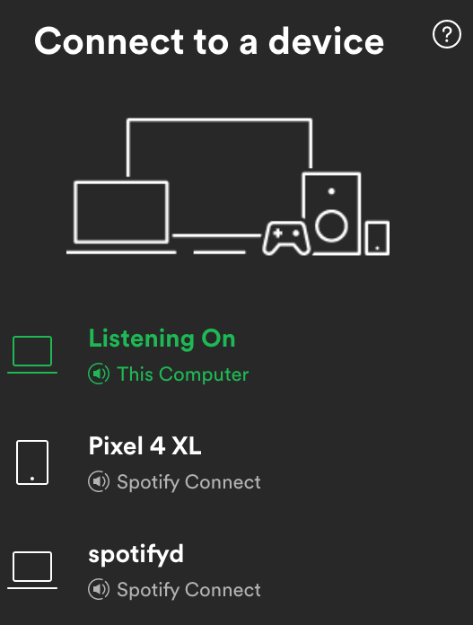

# Useful information for setting up a macOS system
(information is valid as of macOS Monterey)

**Table of contents**:
  - [Shell](#shell)
  - [Sudo](#sudo)
  - [Kerberos + Keytab Access to LXPLUS](#kerberos--keytab-access-to-lxplus)
  - [Mopidy + ncmpcpp](#mopidy--ncmpcpp)
  - [Spotifyd + Spotify-TUI](#spotifyd--spotify-tui)
  - [XQuartz](#xquartz)

## Shell
1. Get current shell:
    ```bash
    dscl . -read ~/ UserShell
    ```
2. Add (e.g. /usr/local/bin/bash) to list of approved shells (part of automated installation):
    ```bash
    echo /usr/local/bin/bash | sudo tee -a /private/etc/shells
    ```
3. Change default shell for the current user (to e.g. /usr/local/bin/bash) (part of automated installation)
    ```bash
    sudo chsh -s /usr/local/bin/bash $(id -un)
    ```

## Sudo
1. Make sudo passwordless for username `sankalptipnis` (part of automated installation):
   Add file (e.g. `sudoers`) to `/etc/sudoers.d` containing "sankalptipnis ALL=(ALL) NOPASSWD:ALL":
    ```bash
    echo "$(id -un) ALL=(ALL) NOPASSWD:ALL" | sudo tee -a /etc/sudoers.d/sudoers
    ```
    
## Kerberos + Keytab Access to LXPLUS
(based on https://frankenthal.dev/post/ssh_kerberos_keytabs_macos/)
1. Install the correct [SSH binary](https://github.com/rdp/homebrew-openssh-gssapi) which supports GSSAPI authentication (part of automated installation):
    ```bash
    $ brew tap rdp/homebrew-openssh-gssapi
    $ brew install rdp/homebrew-openssh-gssapi/openssh-patched --with-gssapi-support
    ```
    It is **NOT** necessary to follow the instructions on the terminal screen after the installation.
2. Place the `krb5.conf` [file](../kerberos/krb5.conf) in `/etc/` (part of automated installation).
3. Edit the `~/.ssh/config` file to include GSSAPI authentication for LXPLUS (part of automated installation).
4. Make a keytab file with your encrypted password. This step is to create a keytab file containing your password that will be fed to the kinit command in order to obtain a Kerberos ticket. On macOS X (which comes with the Heimdal flavor of Kerberos, and not MIT’s) the command to add a password for CERN’s account is:
    ```bash
    $ ktutil -k ~/.ssh/keytab add -p stipnis@CERN.CH -e arcfour-hmac-md5 -V 3
    $ (type your password)
    ```
5. This step should have already been done as part of a previous LXPLUS keytab creation. If not, make your keytab file when logged in to one of the LXPLUS machines:
    ```bash
    $ ktutil 
    $ addent -password -p stipnis@CERN.CH -k 3 -e arcfour-hmac-md5
    $ (type your password)
    $ wkt keytab
    $ quit
    ```
6. Add the follwing command to `~/.bash_profile` (part of automated installation) :
    ```bash
    $ kinit -kt ~/.ssh/keytab stipnis@CERN.CH
    ```
    This will grant you Kerberos tickets without having to type your password.


## Mopidy + ncmpcpp
(based on https://blog.deepjyoti30.dev/using-spotify-with-ncmpcpp-mopidy-linux)

1. Install ncmpcpp, mopidy, mopidy-mpd, mopidy-spotify (part of automated installation):
   ```bash
   brew tap mopidy/mopidy
   brew install ncmpcpp mopidy mopidy-spotify mopidy-mpd
   ```
2. Start mopidy as a service which restarts on subsequent logins (part of automated installation):
   ```bash
   brew tap homebrew/services
   brew services start mopidy
   ```
3. Amend/add `mopidy.conf` in `~/.config/mopidy` with the following entries (you need to fill in your Spotify username and password, and the client id and secret):
   ```
   [core]
   restore_state = true

   [mpd]
   enabled = true
   hostname = 127.0.0.1
   port = 6600

   [spotify]
   enabled = true
   username = 
   password = 
   client_id = 
   client_secret = 
   bitrate = 320
   ```
   Client id and secret can be obtained [here](https://mopidy.com/ext/spotify/) on validating your Spotify login details.
4. Amend/add `config` in `~/.config/ncmpcpp` with at least the following entries (part of automated installation):
   ```
   mpd_host = "127.0.0.1"
   mpd_port = 6600
   mpd_music_dir = ~/Music
   ```

## Spotifyd + Spotify TUI
(based on https://jonathanchang.org/blog/setting-up-spotifyd-on-macos/)
1. Install spotifyd (part of automated installation):
    ```bash
    brew install spotifyd
    ```
2. Create a config file `~/.config/spotifyd/spotifyd.conf` with at least the following contents (part of automated installation):
    ```bash
    [global]
    # Your Spotify account name.
    username = "sankalptipnis"

    # Your Spotify account password.
    password = ""

    # How this machine shows up in Spotify Connect.
    device_name = "spotifyd"
    device_type = "computer"

    # Various playback options. Tweak these if Spotify is too quiet.
    bitrate = 320
    volume_normalisation = true
    normalisation_pregain = -10

    # These need to be set, but don't need to be changed.
    backend = "portaudio"
    mixer = "PCM"
    volume_controller = "softvol"
    zeroconf_port = 1234
    ```
3. Fill out your Spotify password into the file from step 2
4. Start spotifyd:
    ```bash
    brew services start spotifyd
    ```
5. To test that spotifyd is working, open the official Spotify client on your phone or laptop, and confirm that there’s a new device in Spotify Connect:
   
    
   
6. Install Spotify TUI (part of automated installation):
    ```bash
    brew install spotify-tui
    ```
7. Follow the instructions to connect to Spotify's API which will be displayed when you first run Spotify TUI:
    ```bash
    spt
    ```
    The instructions will be along the following lines:
   1. Go to the Spotify dashboard
   2. Click Create an app
   3. You now can see your Client ID and Client Secret
   4.  Now click Edit Settings
   5.  Add http://localhost:8888/callback to the Redirect URIs
   6.  Scroll down and click Save
   7.  You are now ready to authenticate with Spotify!
   8.  Go back to the terminal
   9.  Run spt
   10. Enter your Client ID
   11. Enter your Client Secret
   12. Press enter to confirm the default port (8888) or enter a custom port
   13. You will be redirected to an official Spotify webpage to ask you for permissions.
   14. After accepting the permissions, you'll be redirected to localhost. If all goes well, the redirect URL will be parsed     automatically and now you're done. If the local webserver fails for some reason you'll be redirected to a blank webpage that might say something like "Connection Refused" since no server is running. Regardless, copy the URL and paste into the prompt in the terminal.

8. Re-run Spotify TUI, press d, and select the `spotifyd` device

9.  [OPTIONAL] Use keychain to store Spotify password for spotifyd:
    1. Remove the "password" tag from the file `~/.config/spotifyd/spotifyd.conf`
    2. Add the following tag to the same file `~/.config/spotifyd/spotifyd.conf`:
        ```bash
        # You'll be using the macOS keychain to specify your password.
        use_keyring = true
        ```
    3. Add your Spotify password to the system password manager, keychain:
        ```bash
        security add-generic-password -s spotifyd -D rust-keyring -a sankalptipnis -w <your password>
        ```

## XQuartz
1. Add colour by adding an `.Xdefaults` file with the following contents into the `HOME` directory (part of automated installation):
    ```
    xterm*Background:               black
    xterm*cursorColor:              white
    xterm*Foreground:               white
    ```